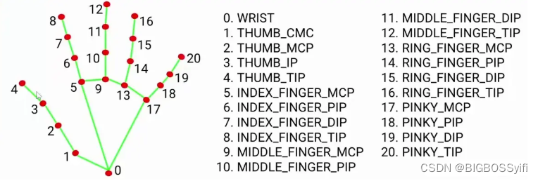

# Hand motion capture and animation in Unity

Eng | [Rus](resources/readme_localisation/readme_ru.md)

## Overview

This project demonstrates how to use Python with OpenCV image capture to achieve:

``` text
* Hand motion detection and recognition; 

* Subsequent real-time data transfer to Unity;

* Hand animation using the obtained data. 
```

### The project consists of two parts

* **Motion Capture** - this part is designed to recognize human hands, process values, and send them to clients. Implemented in `python`. The `config.ini` file stores information about which IP address and port the information should be sent to and whether to render the camera image with real-time point capture processing in real time.

* **Hand control 3D model** - here we deal with receiving data about hand points and further use. Implemented in `Unity`. The `StreamingAssets/config.json` file stores information about which IP address and port the information should be received from.

The `Motion Capture` project must be started first, and only then the `Hand control 3D model`. Otherwise, Unity hangs. When finished, first stop the `Hand control 3D model`, then `Motion Capture`.

### Point capture scheme on the human hand



## Description of demonstration projects in Unity

### Example 1. Primitives

At startup, spheres are created that serve as examples of capture points, as well as lines that connect certain capture points, thanks to this, a semblance of a human hand is obtained.

A controller that receives data via a socket, processes the received data, and moves the spheres according to their positions obtained from the data.


## Information

### Author and Developer

* Kirill Shutov (ShutovKS), Russia

### License

``` text
MIT License
```
